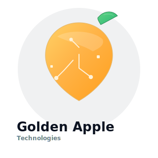

<!-- Golden Apple Technologies README -->
# Golden Apple Technologies 🍏✨

---

## About Us
Golden Apple Technologies is a creative engineering studio based in Kampala, Uganda. We build clean, fast, and beautiful web experiences — from marketing sites and e-commerce shops to full-stack web applications and developer tooling. Our team blends design thinking with engineering rigor to deliver solutions that scale.

Why choose us?
- Human-centered interfaces that convert and delight
- Production-ready code, automated tests, and smooth deployments
- Clear communication and collaborative project delivery

---

## Quick Highlights
- ⚡ Fast, accessible, SEO-friendly frontends  
- 🔒 Secure, tested backends and APIs  
- 🎨 Polished UI/UX and brand-forward design systems  
- 🚀 CI/CD, Docker, and cloud-ready deployments

---

## Services
We help companies ship features and build products.

- Web Design — brand-led UI, prototypes, and design systems  
- Frontend Development — HTML5, CSS3, modern JavaScript, React/Vue/Angular  
- Backend Development — Node.js, Django, Laravel, REST & GraphQL APIs  
- E‑commerce — storefronts, payments, product catalogs, order flows  
- CMS & Content — WordPress, headless CMS, editorial workflows  
- DevOps & Cloud — containers, CI/CD, observability and hosting

---

## Featured Technologies
| Frontend | Backend | DevOps | Data |
|---|---|---:|---|
| HTML5; CSS3; Tailwind; React; Vue | Node.js; Django; Laravel; Java | Docker; GitHub Actions; CI/CD | PostgreSQL; MongoDB; Redis |

---

## Projects & Case Studies
- **Retail E‑commerce** — custom storefront, inventory sync, payment integration  
- **Healthcare Portal** — secure auth, role-based dashboards, reporting  
- **Non‑profit Redesign** — accessible, mobile-first site and donation flow

(Ask for demo links and technical write-ups)

---

## Course & Training Work
We run iAM Scholar — practical developer tracks and bootcamps:
- HTML & CSS, JavaScript, TypeScript, UI/UX, Backend, DevOps
- Project-driven curriculum, labs, rubrics, and capstone projects

---

## Why we stand out
- Expertise: senior engineers who mentor and teach  
- Communication: clear milestones, regular demos, and docs  
- Quality: automated tests, code reviews, and performance checks  
- Innovation: product-minded engineering and rapid prototyping

---

## Brand & Design
To keep a consistent brand:
- Primary color: #FFD166 (gold)
- Accent: #06B6D4 (teal)
- Neutral: #071026 (deep navy)
- Typography: Inter, system UI stacks

Add the SVG logo `dancing.svg` in this repo for best results.

---

## Get in touch
We’d love to hear about your project.

- ✉️ Email: info@goldenappletech.com  
- ☎️ Phone: +256 791 728 084  
- 📍 Address: Golden Apple Technologies, Kampala, Uganda

Or open an issue / discussion on this repo and tag `team:ops`.

---

## Follow us
[Twitter](https://twitter.com/GoldenAppleTech) • [Facebook](https://facebook.com/GoldenAppleTechnologies) • [LinkedIn](https://linkedin.com/company/GoldenAppleTechnologies)

---

## Want to work with us?
1. Share a short brief (goals, timeline, budget)  
2. We’ll schedule a 30‑minute discovery call  
3. Prototype → MVP → Launch with milestones and reviews

---

## Contribute / Careers
We hire engineers, designers, and mentors. Open roles and internship opportunities listed in the `careers/` folder. Submit a CV and portfolio to info@goldenappletech.com.

---

## License
This repo content is available under the MIT License. See LICENSE for details.

---

> Golden Apple Technologies — engineering that feels like craft. 🍏